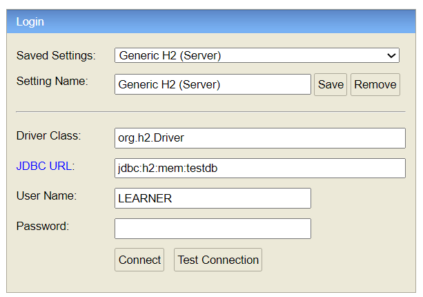
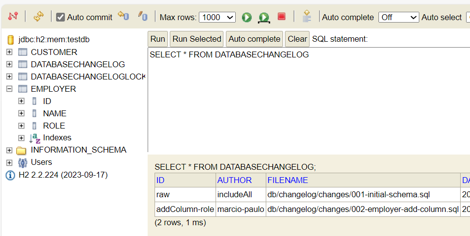

# Start a Spring Boot app with H2 in-memory database and web console
~~~
java -jar target/demo-liquibase-0.0.1-SNAPSHOT.jar --spring.h2.console.enabled=true
~~~
## Open the H2 console in a web browser
~~~
http://localhost:8080/h2-console/
~~~

## H2 Database Connection String
~~~
jdbc:h2:mem:testdb
user=LEARNER
~~~

## Add changesets in sql format

